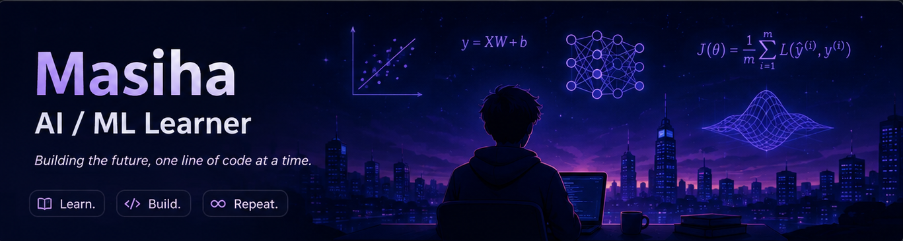

  

# Hi, I'm Masiha 👋

I'm learning **AI / Machine Learning from the ground up.**

 Mathematics & Linear Algebra  
 Machine Learning  
 Python  
 Building projects along the way

Started my AI/ML journey. 

> Learn. Build. Repeat. 🚀

## 🛠️ Tech Stack

  
  
  
  

## 🔥 GitHub Streak

  

## 🐍 Contributions

  <picture>
    <source media="(prefers-color-scheme: dark)" srcset="https://raw.githubusercontent.com/Masiha-prg/Masiha-prg/output/github-contribution-grid-snake-dark.svg">
    <source media="(prefers-color-scheme: light)" srcset="https://raw.githubusercontent.com/Masiha-prg/Masiha-prg/output/github-contribution-grid-snake.svg">
    
  </picture>

## 📈 Activity

  

